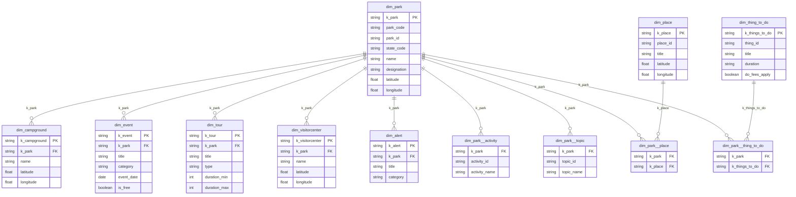

# National Parks Data Pipeline

An end-to-end batch pipeline that pulls data from the [U.S. National Parks Service API](https://www.nps.gov/subjects/developer/api-documentation.htm), lands it in Snowflake, and models it using dbt, orchestrated by Airflow. I built it not only to practice the architecture I work with day to day (API ingestion, a raw landing layer, and a layered, tested dbt model) on a public dataset that's easy to reason about but also interested in exploring the national parks too since I enjoy hiking and love being in nature.

## Architecture


One Airflow DAG is generated per state. Each DAG loops over 12 API endpoints and runs a 4-step pipeline per endpoint: **extract -> upload to S3 -> COPY INTO Snowflake -> cleanup local files**.

- **States covered:** `az`, `ca`, `co`, `ut`, `wa`
- **Endpoints:** `parks`, `activities`, `alerts`, `campgrounds`, `events`, `feepassess`, `parkinglots`, `places`, `topics`, `thingstodo`, `visitorcenters`, `tours`

> **What's built vs. what's next:** I built and run this pipeline **locally** with `airflow standalone`. The diagram shows the full intended architecture **containerizing with Docker and deploying to EC2 are the next iteration** (the repo includes the Docker scaffolding, but the documented, working path is the local run below). This keeps the project reproducible on one machine while showing how it would productionize.

## Folder Structure

```bash
national_parks/
├── dags/
│   ├── config/
│   │   └── nps_config.yaml        # endpoints, states, S3/Snowflake config
│   ├── nps_dag.py                 # dynamic DAG generator (one DAG per state)
│   └── utils/
│       ├── extract_api.py
│       └── s3_to_snowflake.py
├── database/
│   └── create_tables.sql          # Snowflake RAW table DDL
├── nps/                           # dbt project root
│   ├── dbt_project.yml
│   └── models/
│       ├── staging/
│       │   ├── base/              # flatten raw JSON into columns
│       │   └── stage/             # clean, deduplicate, add keys
│       └── marts/                 # dimension / fact 
├── docker-compose.yaml            # scaffolding for the containerized next iteration
└── data/                          # local staging area (temp, cleaned up after load)
```

## Getting Started

You'll need:
- **Python 3.11** (Airflow 2.8.1 doesn't support 3.12+)
- A Snowflake account
- An AWS S3 bucket + IAM user
- A free [NPS API key](https://www.nps.gov/subjects/developer/get-started.htm)

### 1. Clone and set up the environment

```bash
git clone https://github.com/keenzarate/national_parks.git
cd national_parks

python3.11 -m venv ~/.venvs/nps_project
source ~/.venvs/nps_project/bin/activate

# the constraints file is what keeps Airflow's dependency tree from breaking
pip install "apache-airflow[amazon,snowflake]==2.8.1" \
  --constraint "https://raw.githubusercontent.com/apache/airflow/constraints-2.8.1/constraints-3.11.txt"
```

### 2. Start Airflow

```bash
export AIRFLOW_HOME=$(pwd)
airflow standalone
```

This brings up the scheduler + webserver and prints an admin password. Open the UI at `localhost:8080`.

### 3. Set up the AWS S3 bucket

Create a bucket (I named mine `parksdata-nps-2026`) and an IAM user with this policy:

```json
{
  "Version": "2012-10-17",
  "Statement": [
    {
      "Effect": "Allow",
      "Action": ["s3:PutObject", "s3:GetObject", "s3:DeleteObject", "s3:ListBucket"],
      "Resource": [
        "arn:aws:s3:::parksdata-nps-2026",
        "arn:aws:s3:::parksdata-nps-2026/*"
      ]
    }
  ]
}
```

### 4. Add Airflow connections

In the UI under **Admin -> Connections**:

```
nps_api            HTTP                  Host: https://developer.nps.gov/api/v1, Password: <API key>
aws_s3             Amazon Web Services   Login: <Access Key ID>, Password: <Secret>, Extra: {"region_name": "us-east-1"}
snowflake_default  Snowflake             Account: <org-account>, User/Password, Database: nps_warehouse,
                                         Warehouse: compute_wh, Schema: raw, Role: <role>
```

### 5. Set up Snowflake and dbt

Run `database/create_tables.sql` to create the warehouse, database, `raw` schema, the 12 raw landing tables, and the external stage. Then point dbt at Snowflake in `~/.dbt/profiles.yml`:

```yml
national_parks:
  target: dev
  outputs:
    dev:
      type: snowflake
      account: <org-account>
      user: <username>
      password: <password>
      role: <role>
      database: nps_warehouse
      warehouse: compute_wh
      schema: analytics_staging
      threads: 4
```

### 6. Run it

Trigger a DAG in the Airflow UI and verify JSONL lands in S3, the Snowflake RAW tables fill, then build the models:

```bash
cd nps
dbt build          # runs models + tests
dbt docs generate  # lineage graph
```

## Airflow DAG Design

The single DAG file (`nps_dag.py`) loops over the state codes in `nps_config.yaml` to generate one DAG per state at parse time. Each DAG is independent and manually triggered (`schedule_interval=None`).

```
nps_pipeline_dag_<state>
├── extract_<endpoint>                    # PythonOperator -- hits NPS API, writes JSONL locally
├── upload_to_s3_<endpoint>               # PythonOperator -- pushes JSONL to S3
├── copy_from_s3_to_snowflake_<endpoint>  # SnowflakeOperator -- COPY INTO raw table
└── cleanup_local_files_<endpoint>        # PythonOperator -- deletes local temp files
```

All 12 endpoints run in parallel within a single DAG run (no cross-endpoint dependencies).

## Snowflake Setup

Raw tables store the semi-structured API response as a `VARIANT`:

```sql
CREATE TABLE nps_warehouse.raw.parks (
    state_code VARCHAR,
    v VARIANT,
    timestamp TIMESTAMP_NTZ DEFAULT CURRENT_TIMESTAMP,
    load_date VARCHAR
);
```

Each load deletes the existing slice for the state + date, then reloads it -- so re-running a DAG for the same state and date is idempotent:

```sql
DELETE FROM parks
WHERE load_date = '{{ ds_nodash }}' AND state_code = 'az';

COPY INTO parks (state_code, v, timestamp, load_date)
FROM (
    SELECT 'az', $1, CURRENT_TIMESTAMP(), '{{ ds_nodash }}'
    FROM @RAW/nps_data/raw/{{ ds_nodash }}/parks
)
FILE_FORMAT = (TYPE = 'JSON')
PATTERN = '.*\.jsonl';
```

## dbt Project Structure

dbt transforms the raw data through three layers:

- **base/** -- flatten the raw `VARIANT` JSON into typed columns, one model per source:

```sql
-- base_parks.sql
SELECT
    state_code,
    v:parkCode::STRING    AS park_code,
    v:fullName::STRING    AS name,
    v:latitude::FLOAT     AS latitude,
    v:longitude::FLOAT    AS longitude,
    v:designation::STRING AS designation,
    v:states::STRING      AS states,
    timestamp,
    load_date
FROM {{ source('raw', 'parks') }}
```

- **staging/** -- clean, deduplicate, and add surrogate keys. Nested arrays (a park's activities, fees, images) are unpacked into their own models with `lateral flatten`:

```sql
-- stg_parks.sql
SELECT park_code, name, latitude, longitude, designation, states, load_date
FROM {{ ref('base_parks') }}
QUALIFY ROW_NUMBER() OVER (PARTITION BY park_code ORDER BY load_date DESC) = 1
```

- **marts/** -- analytics-ready dimension, fact models built on staging. (still in progress)

### Mart Data Model



**A modeling decision worth noting:** relationship cardinality drives the model type. Where the source links an entity to exactly one park (a campground carries a single `parkCode`, not an array), `k_park` lives directly on that model -- no link table. Link tables (`dim_park__<entity>`) are only used where the source is genuinely many-to-many, like activities, which several parks share.

Tests (`unique`, `not_null`, `relationships`, `accepted_values`) live in the schema YAML next to the models, so referential integrity is checked on every build:

```yaml
models:
  - name: stg_parks
    columns:
      - name: park_code
        tests: [not_null, unique]
```

Here's a couple screenshots of my local deployment: 

- DAG


- Tasks


- Snowflake


- RAW counts
NOTE: I only triggered two states for testing so all other states here have 0 rows


- Sample data


## Issues I ran into

Debugging was a real part of this, so a few worth noting:

- **Hardcoded container path in the DAG.** The config loader pointed at `/opt/airflow/dags/config/...` from the original Docker setup, which doesn't exist when running locally. Switched it to a path relative to the DAG file (`os.path.dirname(__file__)`) so it works in either environment.
- **Snowflake `403 AllAccessDisabled` on COPY.** The external stage had been created before its S3 credentials existed, so Snowflake couldn't read the bucket. `CREATE OR REPLACE STAGE` with valid IAM keys fixed it -- confirmed with `LIST @RAW/...` returning files.
- **Airflow + Python 3.12.** The default interpreter was too new for Airflow 2.8.1 (a `typing_extensions` / `pydantic` clash). Rebuilt the venv on 3.11 and installed with the constraints file.

## Notes and next steps

I built and ran this pipeline locally. It's for fun project, not a hardened production system -- so the natural next steps are about productionizing it:

- **Containerize it** -- package Airflow and the pipeline with Docker / Docker Compose so the environment is reproducible instead of tied to my local machine
- **Deploy to EC2** -- run the containerized stack on an EC2 instance for scheduled, long-running operation rather than manual local runs
- **Orchestrate dbt in Airflow** -- a dbt task that runs after all raw loads finish, instead of running manually
- **Change detection** -- skip the load when the API payload hasn't changed since the last run
- **Snowflake storage integration** -- use a storage integration instead of inline AWS credentials on the external stage
- **More marts** -- model the remaining entities (campgrounds, places, tours) into the dimensional layer

## In progress

- **Data visualization layer** -- a dashboard built on top of the marts to explore the parks data (activities, fees, and park summaries). In the works.
